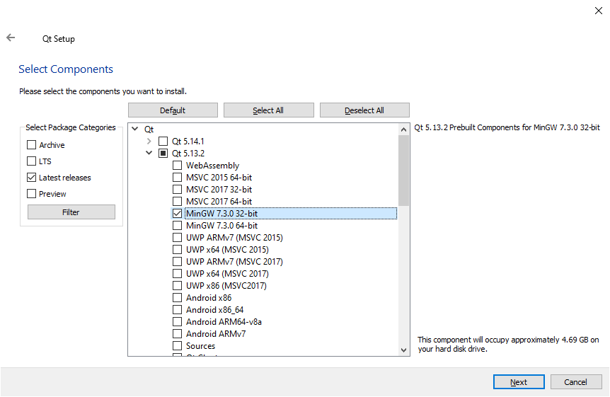
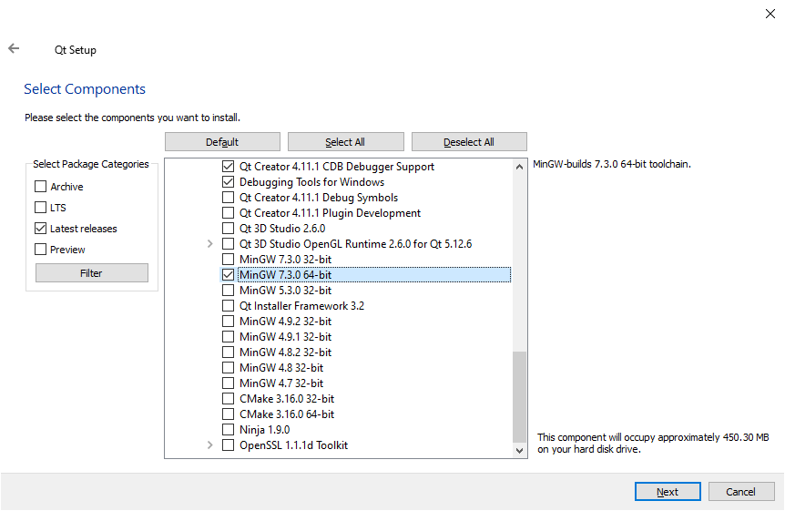
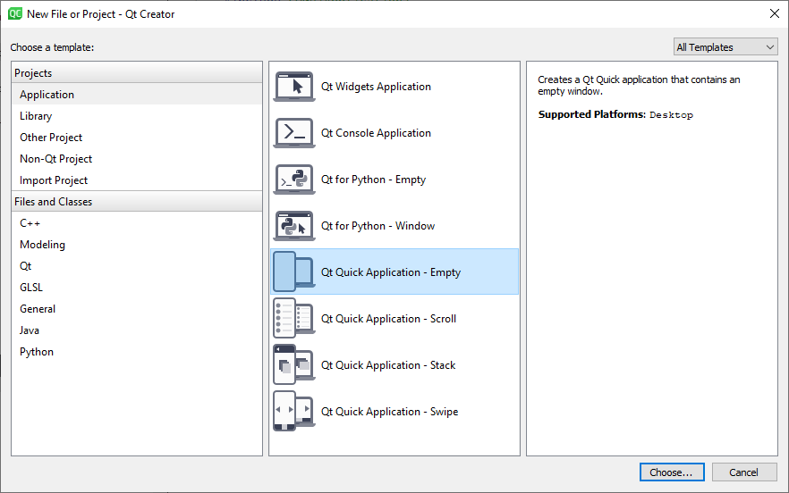
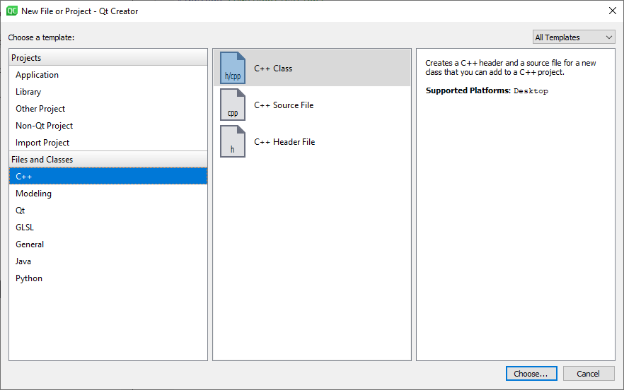
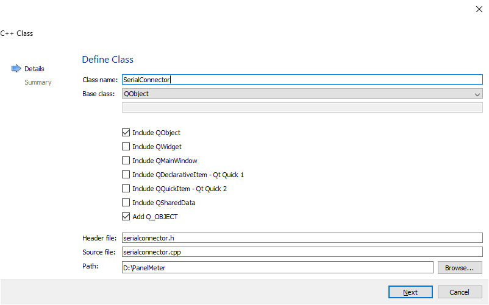
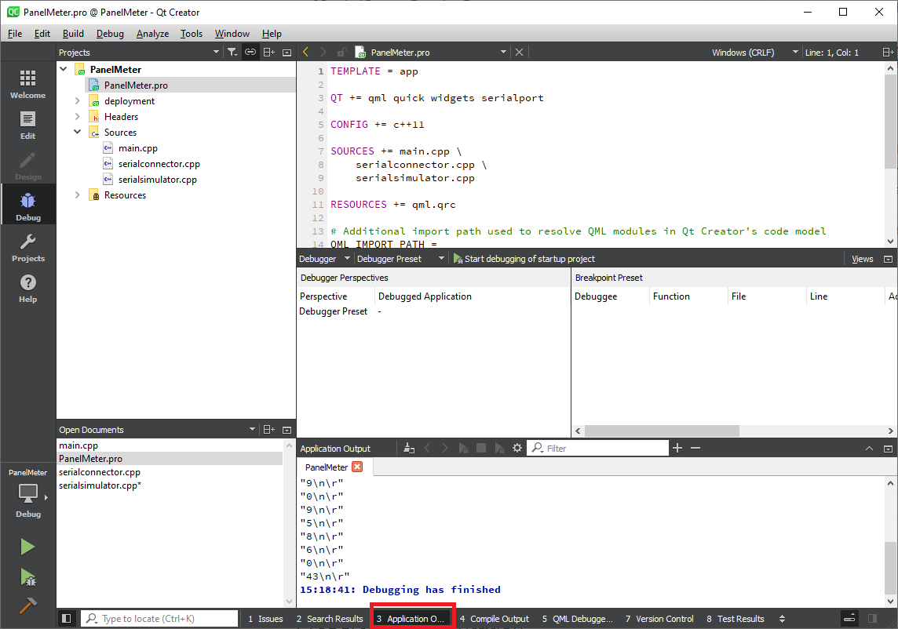
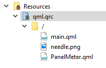
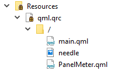

## A mérés célja

A mérés célja a korábbi mérések során megismert egyszerű, hőmérőt és gyorsulás érzékelőt használó eszköz csatlakoztatása RS-232-n keresztül egy Qt keretrendszert használó PC-s klienshez.

> A mérés során a soros porti kommunikációt szimulálunk a SerialSimulator osztállyal. 

### Qt telepítés

A labor otthoni teljesítéséhez telepíteni kell a Qt fejlesztői környezetet. Ezt már Alkalmazásfejlesztésből el kellett végezni, így itt csak a lényeg összefoglalására koncentrálunk:

Az online telepítőt erről az oldalról lehet letölteni:  
https://www.qt.io/download-thank-you

> Újabban már account is kell hozzá, így akinek nincs, az hozzon létre egyet

A megfelelő működéshez 3 komponens kell:
1. __Qt Creator__   
IDE, amiben a fejlesztés zajlik. Minden _támogatott_ platformon ugyanúgy használható
2. __C++ fordító__  
__Windows__ esetében MinGW-t, vagy Visual Studio-t kell használni. Aki nem ragaszkodik a Visual Studio-hoz, használjon MinGW-t, a telepítés kicsit egyszerűbb.  
__Linux__on használjuk a gcc-t  
__OS X__ esetében az Xcode által használt Clang fordítót lehet csak használni.
3. Lefordított Qt frameworkök  
Mivel minden fordítóhoz külön bináris van, azt kell telepíteni, amit a kiválasztott fordítóval fordítottak.

Qt verzióból bármit választhatunk. Arra kell odafigyelni, hogy a verziónkként eltérő a fordítók verziószáma. Ha kiválasztottuk a Qt verziót és a binárisokat is, utána, ugyanazt a fordítót is telepítsük fel (ha még nincs telepítve.)

> Pl. Az _5.14_-es Qt-t Windows+MinGW esetében _MinGW 7.3.0_-al lehet csak fordítani, így ahhoz legalább 7.3.0-ás MinGW-vel is rendelkeznünk kell. Míg az _5.9.9_ esetében az 5.3.0-ás MinGW is jó. 

Aki bizonytalan, Windows esetében, válassza az _5.13_-as Qt-ból _MinGW 7.3.0 64-bit_ verziót és hozzá a _Developer and Designer Tools_-ból a _MinGW 7.3.0 64-bit_-et.





## Mérés menete

A mérés során a __QtCreator__ _QML_ alkalmazás sablonját felhasználva készítjük el a soros adatok fogadását és megjelenítését végző kliensalkalmazást. A mérés során felhasználunk egy előre elkészített komponenst, a _PanelMeter_-t, mely egy külön forrásfájlban található.
> Illetve a sorosport szimulátor forrásait is a mellékletben találjátok.

A mérés célja a Qt keretrendszer által nyújtott többletfunkciók megismerése, mely révén az alkalmazásfejlesztés hatékonyabb és gyorsabban végezhető, mint a natív C++ környezetekben. A mérés során aktívan fogjuk használni a Qt signal-slot modelljét, a QSerialPort soros portot kezelő osztályt*, a QString saját beépített karakterlánc kezelő osztályt, illetve a qDebug szolgáltatásait.

A mérés második felében a C++ kód (alkalmazáslogika) és a QML állományok (felhasználói felületet) közötti kapcsolatot fogjuk megteremteni. Ez utóbbira gyakran van szükség, ha olyan komplex, vagy speciális alkalmazáslogikára van szükségünk, mely nem valósítható meg tisztán QML környezetben.

A mérés során a kötelező feladatok mintamegoldása összesen 2 új fájlból (1 header és cpp), a módosított main.cpp fájlból és a módosított main.qml fájlból áll.

## Felkészülés a mérésre
Annak érdekében, hogy a  gördülékenyen menjen a munka, a felkészülés keretében az alábbiakra térjen ki:
* Ismételje át a kapcsolódó, korábban tanult anyagrészeket (Programozás alapjai és Alkalmazásfejlesztés tárgyak), úgy mint
    * Qt alapok: signal-slot modell, QObject 
    * QSerialPort – (QtSerialDemo)
    * QML UI
    * Qt - Resource Collection Files (.qrc)
 (Az Alkalmazásfejlesztés tárgy jegyzete itt érhető el: http://bmeaut.github.io/snippets/.)
* Ismételje át a korábbi mérés során megvalósított gyorsulást és hőmérsékletet mérő eszköz működését.
* Olvassa át alaposan a mérés keretében befejezett program működésének leírását és ismerkedjen meg a kiadott forráskód részletekkel is.
* Olvassa át a mérési feladatokat és gondolja át, hogyan fogja megoldani őket.

## Kötelező mérési feladatok
Az alábbiak a mérésen kötelezően elvégzendő feladatok. Utána természetesen nagyon örülünk, ha a kiegészítő feladatok közül is elkészít néhányat.

### 0. feladat: Soros Port inicializálása*, Qt projekt létrehozása

Ezek után nyissuk meg a Qt Creatort és készítsünk egy új _Application_ típusú projektet a _Qt Quick Application - Empty_ sablont felhasználva.  



A méréshez tartozó segédanyagok között található SerialSimulator osztály forrásállományai (`serialsimulator.h`,`serialsimulator.cpp`).  
Ezeket másoljuk be a generált projekt gyökérkönyvtárába. (Oda, ahol a `main.cpp` állomány is van.)  
A másolással még nem adódnak hozzá automatikusan a projekthez a forrásállományok. Azokat explicit hozzá kell adnunk, a projekten jobb egérgombra előjövő menüben, az `Add Existing Files...` menüpontot kiválasztva.

### 1. feladat: Soros portot kezelő osztály létrehozása

Mivel az alkalmazásunk még egyáltalán nem tud kommunikálni a panellal* (a szimulátorral),
 így elő lépésként hozzunk létre egy új **osztály**t, a _File_->_New File or Project_ paranccsal. 



Az új osztály neve legyen _SerialConnector_.  
A létrehozásnál figyeljünk oda, hogy QObject leszármazott legyen, ezt ne felejtsük el bejelölni. 
> Ehhez a Base class mezőben válasszuk ki a _QObject_-et. Ekkor az _Include QObject_ és az _Add Q_OBJECT_ mezők is kijelölódnek. Ezen ne is változtassunk.


 
Mivel az alkalmazásunk csak a soros porttal fog kommunikálni, így nem szükséges egy absztrakt fedő osztállyal beburkolnunk, mint a felkészüléshez használt példakódban.

Első lépésként adjuk hozzá az új osztályunkhoz egy SerialSimulator típusú tagváltozót, mely révén menedzselni tudjuk a kommunikációt. 

Ne felejtsük el, a megfelelő fejléc _"serialsimulator.h"_ include-olását.

A soros port inicializálását a konstruktorban végezzük. 

> Itt most elég csak a példányosítást elvégezni, ha szükséges.

> Lehet külön tagfüggvénnyel is, ekkor azonban gondoskodjunk arról, hogy a port mindig megfelelően legyen inicializálva.

> Ha valaki valódi soros porttal szeretne kommunikálni, akkor a .pro kiterjesztésű állományban a QT modulhoz hozzáadni a megfelelő komponenst! Lásd. dokumentáció és példakód.
> 
> Szintén valódi soros port esetében mindenképp be kell állítani a következőket:
> - a port nevét - pl.: "COM4"
> - a sebességet - pl.: `QSerialPort::Baud115200` (egyéni baudrate-et is be lehet állítani)
> -	az adatbitek számát - pl.: `QSerialPort::Data8` 
> -	a stop bitek számát - pl.: `QSerialPort::OneStop`
> -	a paritásbitek számát - pl.: `QSerialPort::NoParity`
> -	a Flow Control módját: - pl.: `QSerialPort::NoFlowControl` 


Ezután definiáljunk, majd implementáljunk, egy-egy `connectSerial`, illetve `disconnectSerial` nevű metódust, amik elvégzik a kapcsolódást, illetve a kapcsolat bontását.

Mivel nem folyamatosan kapunk adatot a soros porton, írjunk egy `slot` függvényt, mely a `SerialSimulator` megfelelő `signal`-jával összekötve értesítést kap arról, ha új adat olvasható a porton. (A szimulatornak csak egy signal-ja van.)

> Az ugyanezen szignatúrával rendelkező `signal`-t a `QSerialPort` a `QIOevice` `signal`-jából örökli.

Így nem kell folyamatosan várakozni, nem fog blokkolódni a programunk futása. (Pl.: Nem kell fölöslegesen várnunk az írással.) 

Ne felejtsük el a `SerialSimulator` tagváltozónk inicializálásakor __összekötni__ a `signal`t az újonnan létrehozott `slot`-tal! 

> Kérdés: Itt miért elég csak simán meghívni a `connect(...)` függvényt, míg a main.cpp-ben mindenképp ki kell írni scope-ot is: `QObject::connect(...)`?

Köszönhetően annak, hogy a `SerialSimulator` (és a `QSerialPort`) nem küldi el a beolvasott adatot, azt minden értesítéskor tőle kell elkérnünk a `readAll()` metódusának meghívásával. A visszakapott adat megjelenítésére nulladik körben használjuk a `qDebug()` metódust.

> A `qDebug()` használata előtt ne felejtsük el include-olni a `<QDebug>`-ot!

Most, hogy készen áll a _soros port_, példányosítsuk a `main.cpp` állományban az osztályunkat!  
Állítsuk be a megfelelő paramétereket, majd hívjuk meg a connect metódust.  

Ha mindent sikerült jól megírni, a fejlesztőkörnyezet _Debug_ nézetben az _Application Output_ fül alatt szépen meg fognak jelenni a fogadott üzenetek.



## 2. feladat: Az üzenetek feldolgozása
Ebben a feladatban a beérkezett adatokból fogjuk az üzeneteket kinyerni, amihez az adatfolyamból fogjuk kivágni a megfelelő részeket.  
Az üzenetek felépítése a következő:  
`#[Típusazonosító]:[számérték]\n\r`  
A Típusazonosító a következő három érték lehet: 
1. `Alarm`
2. `Tilt`
3. `Temp` 

A korábbi feladatban látható, hogy egy üzenet akár több darabban is beérkezhet, de olyan eset is előfordulhat, hogy több üzenet egyszerre érkezik be. 

### 2.a feladat: A beérkezett üzenetek pufferelése

Hogy orvosoljuk a darabos üzenetek problémáját, először is hozzunk lére egy buffert, amibe folyamatosan pakoljuk bele a beérkezett adatot.  
A buffernek nyilván egy új `QByteArray` típusú tagváltozónak kell lennie, amit nem árt kiüríteni, mielőtt elkezdjük hozzáfűzni (az `append(...)` függvénnyel) a beérkező adatot.

### 2.b feladat: az értelmes üzenetek kiszűrése

Egy új adatcsomag beérkezésekor könnyen előfordulhat, hogy egy (vagy akár több!) értelmezhető üzenet lesz a bufferben.  
Ennek észleléséhez hozzunk létre egy `private` segédfüggvényt `getMessage` néven a `SerialConnector`-on belül. Ennek a függvénynek az lesz a feladata, hogy végigmegy a beolvasott adaton (a bufferen), és ha talál értelmes üzenetet, azt kiveszi és továbbadja egy később implementálandó újabb segédfüggvénynek.  
Ennek az újabb üzenet értelmező segédfüggvénynek adjuk a `decodeMessage` nevet és `QString`-et várjon paraméterként.  
> Szerencsére létezik konverzió a QByteArray és a QString között, így érdemes az egész buffert QString-gé konvertálni.

Ha megvan a konverzió, a kapott karaktersorozat már szét lehet választani a sortörés+kocsivissza karakterek mentén `\n\r`.  
Ehhez használjuk a `QString` megfelelő (`split(...)`) metódusát mely egy `QStringList`-et ad vissza.  
Az utolsó, rosszabb esetben fél, üzenet hagyjuk meg.  
Ezután adjuk át egyenként az így szétvágott üzeneteket a `decodeMessage(...)` függvényünknek.  
A visszatérés előtt pedig vágjuk le a buffer elejéről a megfelelő mennyiségű bájtot.
> Ezt úgy tehetjük meg, hogy számoljuk, hogy milyen hosszú üzeneteket adunk át dekódolásra, majd ez alapján eldobjuk a megfelelő méretű fölöslegessé vált bájt tömböt. (Pl.: a `QByteArray` `left(...)` metódusával)

### 2.c feladat: Az üzenetek szétválogatása

A feladatot az előző részfeladatban használt megoldás segítségével egyszerűen meg tudjuk oldani.  
A kapott üzenet egy `típusazonosító`ból, egy `elválasztó karakter`ből és egy `szám`ból áll.  
A legegyszerűbb az `elválasztó karakter` mentén  két részre bontani az üzenetet. 
> Figyeljünk oda, hogy tényleg két rész jött-e létre `split(...)` eredményeként. A tömböt nem jó túlindexelni.

Ha sikeresen kiszedtük az üzenet _típusát_ és az "értékét" (a *szám*ot), akkor `emit`táljunk egy-egy típusazonosítóként eltérő `signal`-t, melyben a beolvasott _szám_, mint `QVariant` szerepel.  
Ehhez természetesen definiálni kell a megfelelő `signal`-okat:
```qt
signals:
    void tempChanged(QVariant);
    void tiltChanged(QVariant);
    void alarmChanged(QVariant);
```

### 3. feladat: Az üzenetek "megjelenítése"
Ebben a feladatban a kiadott `PanelMeter.qml` állomány felhasználva ki fogjuk egészíteni a main.qml állományt, hogy mind a dőlésszög érzékelő, mind a hőmérő adatait meg tudjuk jeleníteni.

Ehhez először is a `qml.qrc` állományban adjuk hozzá az erőforrás gyökeréhez a `PanelMeter.qml`-t, illetve a mellékelt `needle.png` fájt.



Utóbbinak állítsuk be a `needle` nevet, mint alias.  
Hogy ez utóbbit meg tudjuk tenni, a `qml.qrc` állomány fölé kell vinni az egeret, majd az egér jobb gombjára előugró menüben válasszuk az `Open in Editor` menüpontot.  
Itt válasszuk ki a needle.png-t, majd a `Properties` panelon töltsük ki az `Alias` mezőt `needle`-re.  
Ha jól csináltuk az alábbi eredményt kapjuk:  


Ezután példányosítsunk a `PanelMeter`-ből 2 darabot a `main.qml` állományban.  
A két modul legyen egymás mellett, a bal felső saroktól 10-10 képpontra.  
Adjunk a két modulnak külön-külön nevet (temperatureMeter, tiltMeter) az `objectName` property beállítsásval.  
Állítsuk be a neveiket (`objectName`) rendre `"TempMeter"`, illetve `"TiltMeter"`-nek.

Ezután menjünk át a `main.cpp` állományba és kössük össze a "megfelelő" signal-okat a hozzájuk tartozó slotokkal. 

> Ehhez át kell néznünk a `PanelMeter.qml` fájlt és keresnünk kell benne két használató `slot`-ot. Az egyiket arra használjuk majd, hogy a számértéket frissítsük, a másikat pedig arra, ha riasztás állapotában vagyunk, jelezni tudjuk.  
Érdemes átismételni, hogy QML-ben hogy definiálunk `slot`-ot.

Az összekötéshez szükségünk van a c++ oldalon az két PanelMeter-re. Ehhez először is a `QQmlApplicationEngine` objektumunktól (ami alapértelmezetten `engine` névre hallgat) kérjük el annak gyökér objektumát.  
Mivel elvben több is lehet neki, így csak a `rootObjects()` metódus van implementálva, ami egy `QObject*` pointereket tartalmazó listát ad vissza.  
Ennek az első (0.) eleme az, ami nekünk kell.  
Ezután a kapott `QObject`-ben lévő gyermek elemeket kell megtalálni. Ehhez a `QObject` `findChild` sablonparaméteres (templates) metódusát tudjuk használni, ami az előbb definiált `objectName`-et várja. 
> Érdemes megnézni, a Qt dokumentációjában, hogy hogyan is néz ki a függvény szignatúrája.

Mivel nekünk `QObject*` pointerre van szükségünk, így legyen ez a sablon paramétere.  
Mivel két objektumot szeretnék visszakapni, így kétszer kell meghívni a függvényt más-más paraméterrel.  
A visszakapott objektumok `slot`-jaihoz (az előbb megtalált kettőhöz) kössük be a megfelelő `signal`-okat.  
- A `tiltChanged(QVariant)`-hoz a `TiltPanel` `valueChanged(QVariant)` `slot`-ját  
- A `tempChanged(QVariant)`-hoz a `TempPanel` `valueChanged(Qvariant)` `slot`-ját
- Az `alarmChanged(QVariant)`-hoz mindkét objektum `alarmStateChanged(QVariant)` `slot`-ját (2 külön `connect` utasítás) kössük be.

Teszteljük az elkészült alkalmazást!

Ha nem akarnának nagyon kitérni a mutatók, akkor a `PanelMeter` `ratio` property-jét állítsuk nagyobbra a `main.qml`-ben.
